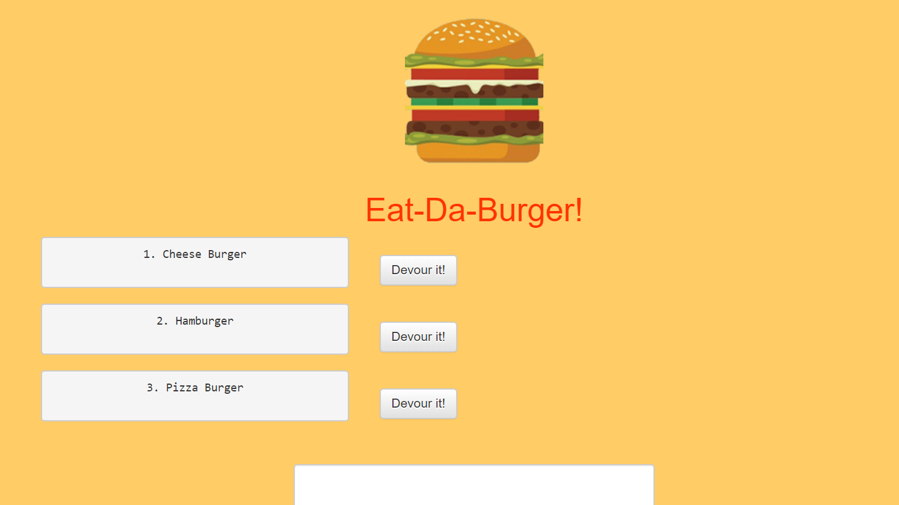
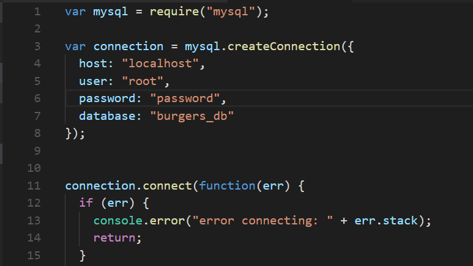
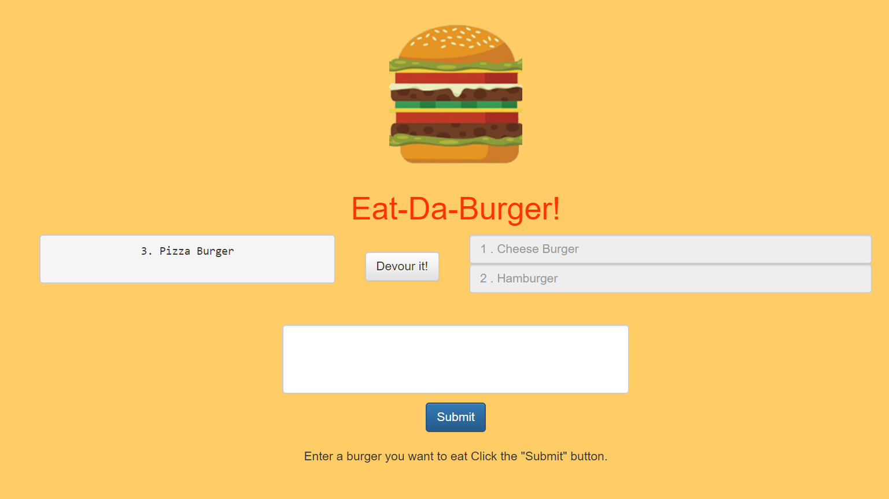
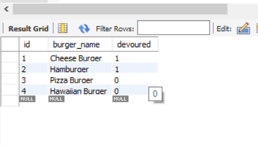
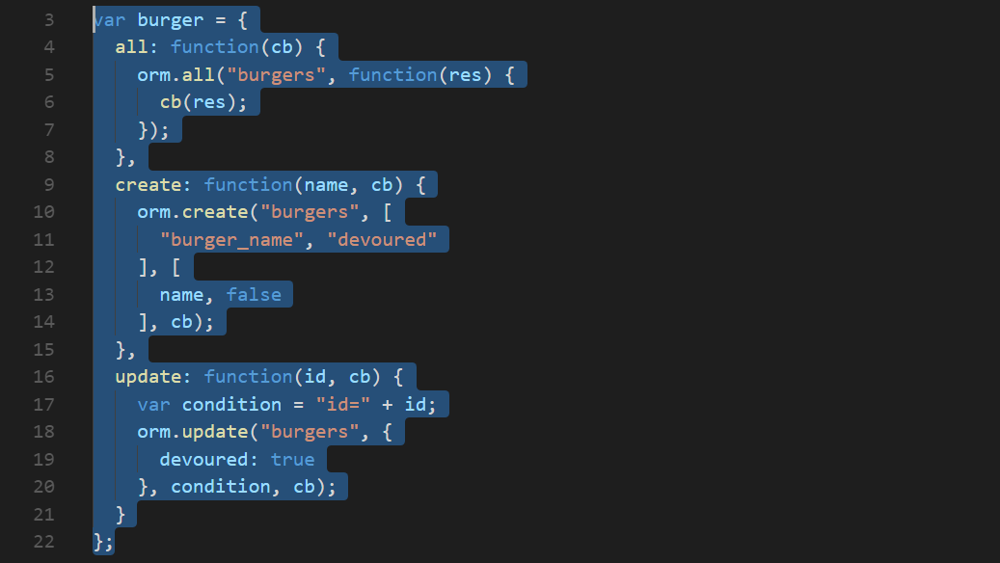

# Burger
Burger logger with MySQL, Node, Express, Handlebars and a homemade ORM


### Prerequisites

```
npm init
npm install express
npm install express-handlebars
npm install method-override
npm install body-parser
npm install mysql
```

- Navigate to Burger/config/connection.js folder and set the password to create a MySQL connection. 



```
var connection = mysql.createConnection({
  host: "localhost",
  user: "root",
  password: "password", <--- *Set this to your mysql workbench password* 
  database: "burgers_db"
});
```

- Open the db folder and import schema.sql & seeds.sql into mysql workbench then connect

```
$ node server.js
Listening on port:8000
connected as id 15
```
## Function

- Whenever a user submits a burger's name, app will display the burger on the left side of the page -- waiting to be devoured.

- Each burger in the waiting area also has a `Devour it!` button. When the user clicks it, the burger will move to the right side of the page.



- Your app will store every burger in a database, whether devoured or not.



## Burger Database Setup

   * Created a `burgers` table with the fields:
     * **id**: an auto incrementing int that serves as the primary key.
     * **burger_name**: a string.
     * **devoured**: a boolean.
 
 
## Config Folder Setup

- Inside the `connection.js` file, the code is setup to connect Node to MySQL.
- In the `orm.js` file,  methods will execute the necessary MySQL commands in the controllers. 

```
     * `selectAll()` 
     * `insertOne()` 
     * `updateOne()` 
```
 
## Model Setup

* /models/burger.js *

- inside is the code that will call the ORM functions using burger specific input for the ORM.



## Controller Setup

* /controllers/burgerControllers *
- Create the `router` for the app

- For more information on routes click here [Express routing](https://expressjs.com/en/guide/routing.html)

## View Setup

- Inside your `burger` directory, there is a folder named named `views`:

     * Created the `index.handlebars` file inside `views` directory.

     * Created the `layouts` directory inside `views` directory.

     * Created the `main.handlebars` file inside `layouts` directory.

     * Setup the `main.handlebars` file so it's able to be used by Handlebars.

     * Setup the `index.handlebars` to have the template that Handlebars can render onto.

     * Created a button in `index.handlebars` that will submit the user input into the database.
     
     
## Built With

* [VSCode](http://www.dropwizard.io/1.0.2/docs/) - Code Editor
* [Node](https://nodejs.org/en/) - Application runtime environment that allows you to write server-side applications in JavaScript
* [MySQL](https://www.mysql.com/products/workbench/) - Back-End Database
* [Express](https://expressjs.com/) - Node.js framework
* [Handlebars](https://handlebarsjs.com/) - Semantic Templating

## Authors

* **Christopher Bermudez** - *Homework From* - 2017-2018 UCF Coding Bootcamp

## License

This project is licensed under the MIT License - see the [LICENSE.md](LICENSE.md) file for details


